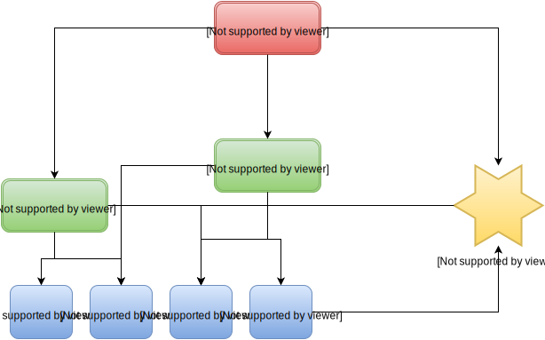

# Anchor
## The Church orginization and connection app of the future.

This iPhone (and later Android) app is basically Facebook for Churches, with more infrastructure.

There are three types of things in this app setup:

- Realms
- Groups (go inside Realms)
- Members (can be Administrators or Normal)

Here's basically how this works:

- Any Member can create a Realm, and is automatically an Administrators for that Realm.
- Any Member can apply for membership or admin access to a realm, and his/her request is sent to the origonal admin for that realm.
- Any Admin for a Realm can create groups under that realm, and also do posts to the entire realm or a group in that realm.
- Any Member that is part of a realm, admin or not, can comment on posts in that realm.
- If you are not part of a realm, you cannot view anything in that realm, only it's name, and submit an application to it.

Here's a helpful diagram that should make this structure clearer:
